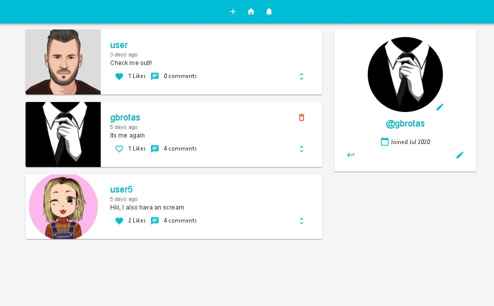

# Social Midia Frontend

## About
  Projeto criado para simular uma rede social inspirada no twitter utilizando o ReactJS. Nessa rede social o usuario pode postar texto, interagir com os posts de outras pessoas, alterar foto do perfil e sua bio e também receber notificações. 
  
## Libraries
  @material-ui/core
  @material-ui/icons
  axios
  dayjs
  jwt-decode
  react-router-dom
  redux
  react-redux
  redux-thunk
  
## Photos

